# Epic Architecture Specification: Prototype 1 - Core Recipe Generation MVP

## 1. Epic Architecture Overview

**Prototype 1** establishes the foundational mobile architecture for an AI-powered recipe generation application. The system leverages a **cloud-first, Firebase-centric architecture** with **Flutter** as the cross-platform UI framework and **Google's Gemini AI** (via Firebase AI Logic) as the intelligence layer.

### Architectural Approach

This is a **layered mobile architecture** following **Clean Architecture** principles with feature-based modularization:

- **Presentation Layer**: Flutter UI screens and widgets organized by feature, with Riverpod for reactive state management
- **Application/Service Layer**: Core services (AI, authentication, permissions), repositories (data abstraction), and caching logic
- **Data Layer**: Firebase backend (Auth, Firestore) for cloud persistence, Hive for local caching, and Gemini API for AI inference
- **Security Layer**: Firebase Auth for identity, App Check for API protection, and Firestore rules for authorization
- **Integration Layer**: Device capabilities (camera, image picker, network) and external services

### Key Architectural Decisions

1. **No Custom Backend**: Firebase is the sole backend—no Node.js/Python servers. All business logic resides in Flutter (client-side) or Firebase (cloud functions in future).

2. **Cloud-Based AI**: Gemini API runs inference in Google Cloud. No on-device ML models. This simplifies deployment but requires internet connectivity.

3. **Recipe Caching Strategy**: Firestore `recipe_cache` collection stores AI-generated recipes keyed by `{userId}_{hash(ingredients+preferences)}` to reduce API quota usage and improve latency.

4. **Per-User Data Isolation**: Firestore security rules enforce strict user boundaries. All collections have a `user_id` field; rules check `request.auth.uid == resource.data.user_id`.

5. **Offline-First for Viewing**: Hive caches saved recipes locally for offline viewing. Online required for AI features and sync.

6. **Feature-Based Modules**: Code organized under `lib/features/*` (auth, camera, ingredient_detection, recipe_generation, pantry, profile, etc.), each with domain/data/presentation layers.

### Technology Stack Summary

| Layer | Technologies |
|-------|-------------|
| **UI Framework** | Flutter 3.24+ (Dart 3.9.2) |
| **State Management** | Riverpod 2.5.1 (with codegen: `riverpod_generator`) |
| **Backend** | Firebase (Auth, Firestore, App Check) |
| **AI/ML** | Firebase AI Logic + Gemini API (`gemini-2.5-flash`) |
| **Local Storage** | Hive 2.2.3 (offline recipe cache) |
| **Media** | camera 0.11.0, image_picker 1.1.2, permission_handler 11.3.1 |
| **Code Generation** | build_runner, freezed, json_serializable |
| **Image Processing** | image 4.2.0 (resize, normalize) |
| **UI Enhancements** | google_fonts, flutter_animate, font_awesome_flutter |

---

## 2. System Architecture Diagram

```mermaid
flowchart TD
    subgraph "User Layer"
        user[👤 User<br/>Mobile iOS/Android]
    end

    subgraph "Presentation Layer - Flutter UI"
        direction TB
        screens[📱 Screens]
        widgets[🧩 Widgets]
        providers[🔄 Riverpod Providers]
        
        screens --> widgets
        screens --> providers
        widgets --> providers
        
        style screens fill:#e1f5ff
        style widgets fill:#e1f5ff
        style providers fill:#fff3cd
    end

    subgraph "Application/Service Layer"
        direction TB
        gemini[🤖 GeminiAIService<br/>EXISTING]
        perm[🔐 PermissionService<br/>EXISTING]
        image_proc[🖼️ ImageProcessor<br/>EXISTING]
        
        subgraph "Repositories"
            auth_repo[👤 AuthRepository<br/>EXISTING]
            recipe_repo[🍳 RecipeRepository<br/>EXISTING]
            cache_repo[💾 CacheRepository<br/>NEW]
            pantry_repo[🥬 PantryRepository<br/>EXISTING]
            profile_repo[👥 ProfileRepository<br/>EXISTING]
        end
        
        style gemini fill:#d1ecf1
        style perm fill:#d1ecf1
        style image_proc fill:#d1ecf1
        style cache_repo fill:#d4edda
    end

    subgraph "Data Layer"
        direction TB
        
        subgraph "Firestore Collections"
            profiles[(📋 profiles<br/>EXISTING)]
            prefs[(⚙️ user_preferences<br/>EXISTING)]
            recipes[(🍽️ recipes<br/>EXISTING)]
            rcache[(💾 recipe_cache<br/>NEW)]
        end
        
        hive[(📦 Hive Local Storage<br/>EXISTING)]
        gemini_api[(☁️ Gemini API<br/>gemini-2.5-flash)]
        
        style rcache fill:#d4edda
    end

    subgraph "Security Layer"
        auth[🔒 Firebase Auth<br/>EXISTING]
        appcheck[🛡️ App Check<br/>EXISTING]
        rules[📜 Firestore Rules<br/>EXISTING]
    end

    subgraph "Integration Layer"
        camera[📷 Device Camera<br/>EXISTING]
        picker[🖼️ Image Picker<br/>EXISTING]
        network[🌐 Network<br/>EXISTING]
    end

    %% User interactions
    user --> screens

    %% Presentation to Service Layer
    providers --> gemini
    providers --> perm
    providers --> image_proc
    providers --> auth_repo
    providers --> recipe_repo
    providers --> cache_repo
    providers --> pantry_repo
    providers --> profile_repo

    %% Service to Data Layer
    auth_repo --> auth
    recipe_repo --> recipes
    cache_repo --> rcache
    pantry_repo --> recipes
    profile_repo --> profiles
    profile_repo --> prefs
    
    %% Recipe caching flow
    providers -->|1. Check cache| cache_repo
    cache_repo -->|2a. Cache HIT| providers
    cache_repo -->|2b. Cache MISS| gemini
    gemini -->|3. Generate recipe| gemini_api
    gemini -->|4. Return result| cache_repo
    cache_repo -->|5. Save to cache| rcache
    cache_repo -->|6. Return recipe| providers

    %% AI flow
    gemini -. cloud async .- gemini_api
    
    %% Local storage
    recipe_repo --> hive
    
    %% Security enforcement
    auth --> rules
    appcheck --> rules
    rules -. authorize .- recipes
    rules -. authorize .- rcache
    rules -. authorize .- profiles
    rules -. authorize .- prefs
    
    %% Device integrations
    providers --> camera
    providers --> picker
    gemini --> network
    
    %% Image processing flow
    camera --> image_proc
    picker --> image_proc
    image_proc --> gemini

    %% Legend
    classDef existing fill:#e1f5ff,stroke:#0066cc,stroke-width:2px
    classDef new fill:#d4edda,stroke:#28a745,stroke-width:2px
    classDef service fill:#d1ecf1,stroke:#17a2b8,stroke-width:2px
```



### Architecture Flow Descriptions

#### 1. **Recipe Generation Flow (Core Workflow)**

```
User → Home Screen → "Scan Fridge" Button
  ↓
Camera Permission Check (PermissionService)
  ↓
Camera Preview → Capture Photo → Image Bytes
  ↓
ImageProcessor.preprocessForInference() → 512×512, normalized
  ↓
IngredientDetectionProvider → GeminiAIService.detectIngredients()
  ↓
Gemini API (multimodal: image + text prompt) → Ingredient List
  ↓
User Confirms/Edits Ingredients → "Generate Recipe" Button
  ↓
RecipeGenerationProvider → Check Cache
  ├─ CacheRepository.getCachedRecipe(cacheKey)
  │   └─ Cache HIT → Return cached recipe (instant)
  └─ Cache MISS → GeminiAIService.generateRecipe()
      ↓
      Gemini API (text prompt with ingredients + preferences) → Recipe JSON
      ↓
      CacheRepository.cacheRecipe() → Save to recipe_cache collection
      ↓
      RecipeRepository.saveRecipe() → Save to recipes collection
      ↓
      Hive.put() → Cache locally for offline viewing
      ↓
Recipe Detail Screen → Display to User
```

#### 2. **Authentication Flow**

```
Welcome Screen → "Sign Up" or "Sign In" Button
  ↓
AuthRepository.signUp() / signIn() / signInWithGoogle()
  ↓
Firebase Auth → Create/Authenticate User
  ↓
AuthRepository.createUserProfile() (on signup)
  ├─ profiles collection → Create document (user_id = UID)
  └─ user_preferences collection → Create document (default preferences)
  ↓
AuthStateChanges Stream → currentUserProvider updates
  ↓
App Shell (Home Screen with Bottom Nav)
```

#### 3. **Pantry Management Flow**

```
My Pantry Screen → "Add Ingredient" Button
  ↓
PantryProvider.addIngredient(name) → Local state update
  ↓
Optional: Persist to Firestore (future: pantry_items collection)
  ↓
"Use in Recipe" Button → Navigate to Home Screen
  ↓
Auto-populate ingredient list → Generate Recipe
```

#### 4. **Offline Recipe Viewing Flow**

```
User Opens App (Offline)
  ↓
My Recipes Tab → RecipeHistoryProvider
  ↓
Hive.get(recipeBox) → Load cached recipes
  ↓
Display Recipe List → User Selects Recipe
  ↓
Recipe Detail Screen (full offline access)
```

---

## 3. High-Level Features & Technical Enablers

### 3.1 Core Features (User-Facing)

| Feature | Description | Status | Feature Module |
|---------|-------------|--------|----------------|
| **Email/Password Auth** | Sign up, login, password reset | ✅ EXISTING | `features/auth` |
| **Google Sign-In** | OAuth authentication | ✅ EXISTING | `features/auth` |
| **Camera Capture** | Real-time preview, capture, flash toggle | ✅ EXISTING | `features/camera` |
| **Gallery Picker** | Select photos from device gallery | ✅ EXISTING | `features/camera` |
| **Ingredient Detection** | AI-powered ingredient extraction from photos | ✅ EXISTING | `features/ingredient_detection` |
| **Recipe Generation** | Personalized AI recipe creation | ✅ EXISTING | `features/recipe_generation` |
| **Recipe History** | View saved recipes | ✅ EXISTING | `features/recipe_history` |
| **Favorites** | Mark and filter favorite recipes | ✅ EXISTING | `features/favorites` |
| **Pantry Management** | Manual ingredient entry and management | ✅ EXISTING | `features/pantry` |
| **User Profile** | View/edit profile info | ✅ EXISTING | `features/profile` |
| **Cooking Preferences** | Skill level, dietary restrictions, cuisines | ✅ EXISTING | `features/profile` |
| **Recipe Detail View** | Full recipe display with ingredients, steps | ✅ EXISTING | `features/recipe_detail` |
| **Recipe Rating & Notes** | 1-5 star rating, personal notes | ✅ EXISTING | `features/recipe_detail` |
| **Theme Toggle** | Light/dark mode | ✅ EXISTING | `shared/providers` |
| **Offline Recipe Viewing** | View cached recipes without internet | ✅ EXISTING | `features/recipe_history` |

### 3.2 Technical Enablers (Infrastructure)

#### 3.2.1 Existing Components (Reused)

| Component | Purpose | Location |
|-----------|---------|----------|
| **GeminiAIService** | Gemini API integration (ingredient detection, recipe generation) | `core/services/gemini_ai_service.dart` |
| **PermissionService** | Camera, storage permission handling | `core/services/permission_service.dart` |
| **ImageProcessor** | Image resize (512×512), normalization, preprocessing | `core/utils/image_processor.dart` |
| **AuthRepository** | Firebase Auth operations (signup, login, logout) | `features/auth/data/repositories/auth_repository_impl.dart` |
| **RecipeRepository** | CRUD operations for recipes collection | `features/recipe_generation/data/repositories/recipe_repository_impl.dart` |
| **PantryRepository** | Pantry ingredient management | `features/pantry/data/repositories/pantry_repository_impl.dart` |
| **ProfileRepository** | User profile and preferences CRUD | `features/profile/data/repositories/profile_repository_impl.dart` |
| **FirebaseProviders** | Global Firebase Auth, Firestore instances | `shared/providers/firebase_provider.dart` |
| **ThemeProvider** | App theme state (light/dark) | `shared/providers/theme_provider.dart` |
| **Hive Boxes** | `recipeBox`, `preferencesBox` for local caching | Initialized in `main.dart` |

### 3.3 Prompt Template Updates

#### 3.3.1 Existing Prompts (in `core/constants/prompt_templates.dart`)

| Prompt | Purpose | Status |
|--------|---------|--------|
| **getIngredientDetectionPrompt()** | Extract ingredients from image | ✅ EXISTING |
| **getRecipeGenerationPrompt()** | Generate recipe JSON from ingredients + preferences | ✅ EXISTING |

#### 3.3.2 Planned Prompt Enhancements

| Enhancement | Description | Priority |
|-------------|-------------|----------|
| **Improved JSON Structure** | Ensure consistent JSON schema for recipes | 🟡 MEDIUM |
| **Better Error Handling** | Add fallback prompts if Gemini returns malformed data | 🟡 MEDIUM |
| **Streaming Support** | Update prompts for streaming responses (future) | 🟢 LOW |

### 3.4 Firestore Data Model Changes

#### 3.4.1 New Collection: `recipe_cache`

```dart
// Document ID: {userId}_{cacheKey}
// Example: "abc123_4f8d9c2a1b3e5f7g"

{
  "user_id": "abc123",              // String (matches auth UID)
  "cache_key": "4f8d9c2a1b3e5f7g",  // String (hash of ingredients + prefs)
  "cached_recipe": {                // Map (full recipe object)
    "recipe_name": "Chicken Stir Fry",
    "description": "Quick and easy...",
    "cuisine_type": "Asian",
    "difficulty_level": "beginner",
    "prep_time": 10,
    "cook_time": 20,
    "total_time": 30,
    "servings": 4,
    "ingredients": [
      {"name": "chicken breast", "quantity": "500g"},
      {"name": "soy sauce", "quantity": "3 tbsp"}
    ],
    "instructions": ["Step 1...", "Step 2..."],
    "dietary_tags": ["gluten-free"],
    "allergens": ["soy"]
  },
  "created_at": Timestamp,          // Firestore server timestamp
  "expires_at": Timestamp           // Optional: TTL field (7 days from creation)
}
```

**Security Rule** (add to `firestore.rules`):
```javascript
match /recipe_cache/{cacheId} {
  allow read: if request.auth != null && 
              cacheId.matches('^' + request.auth.uid + '_.*');
  allow write: if request.auth != null && 
               request.resource.data.user_id == request.auth.uid &&
               cacheId.matches('^' + request.auth.uid + '_.*');
  allow delete: if request.auth != null && 
                resource.data.user_id == request.auth.uid;
}
```

**Firestore Index** (add to `firestore.indexes.json`):
```json
{
  "indexes": [
    {
      "collectionGroup": "recipe_cache",
      "queryScope": "COLLECTION",
      "fields": [
        { "fieldPath": "user_id", "order": "ASCENDING" },
        { "fieldPath": "created_at", "order": "DESCENDING" }
      ]
    }
  ]
}
```

#### 3.4.2 Existing Collections (No Changes)

| Collection | Purpose | Status |
|------------|---------|--------|
| **profiles** | User profile data (display_name, avatar_url, bio) | ✅ EXISTING |
| **user_preferences** | Cooking preferences (skill_level, dietary_restrictions) | ✅ EXISTING |
| **recipes** | Saved recipes (user_id scoped, full recipe data) | ✅ EXISTING |

### 3.5 Caching Strategy Details

#### Cache Key Generation Algorithm

```dart
// Pseudocode for cache key generation

String generateCacheKey({
  required List<String> ingredients,
  required UserPreferences preferences,
}) {
  // Sort ingredients alphabetically for consistency
  final sortedIngredients = List<String>.from(ingredients)..sort();
  
  // Create hash input string
  final hashInput = [
    sortedIngredients.join(','),
    preferences.skillLevel,
    preferences.dietaryRestrictions.join(','),
    preferences.spiceTolerance,
    preferences.cookingTimePreference,
    preferences.favoriteCuisines.join(','),
  ].join('|');
  
  // Generate SHA-256 hash (first 16 chars)
  return sha256.convert(utf8.encode(hashInput))
      .toString()
      .substring(0, 16);
}
```

#### Cache Hit/Miss Logic

```dart
// Pseudocode for cache check workflow

Future<Recipe> getRecipeWithCache({
  required List<String> ingredients,
  required UserPreferences preferences,
}) async {
  // 1. Generate cache key
  final cacheKey = generateCacheKey(
    ingredients: ingredients,
    preferences: preferences,
  );
  
  // 2. Check Firestore cache
  final cached = await cacheRepository.getCachedRecipe(
    userId: currentUser.uid,
    cacheKey: cacheKey,
  );
  
  // 3a. Cache HIT → Return immediately
  if (cached != null && !cached.isExpired(maxAge: 7.days)) {
    logEvent('recipe_cache_hit');
    return cached.recipe;
  }
  
  // 3b. Cache MISS → Call Gemini API
  logEvent('recipe_cache_miss');
  final recipe = await geminiService.generateRecipe(
    ingredients: ingredients,
    dietaryRestrictions: preferences.dietaryRestrictions,
    skillLevel: preferences.skillLevel,
    cuisinePreference: preferences.favoriteCuisines.first,
  );
  
  // 4. Save to cache for next time
  await cacheRepository.cacheRecipe(
    userId: currentUser.uid,
    cacheKey: cacheKey,
    recipe: recipe,
  );
  
  return recipe;
}
```

#### Cache Invalidation

- **TTL**: Cached recipes expire after 7 days (configurable in `AppConstants`)
- **Manual Clear**: User can clear cache via Settings (future)
- **Preference Change**: Cache invalidated when user updates dietary restrictions or skill level (future enhancement)

### 3.6 Performance Instrumentation

#### Manual Logging (Current)

```dart
// Pseudocode for performance logging

Future<Recipe> generateRecipe() async {
  final startTime = DateTime.now();
  
  try {
    final recipe = await geminiService.generateRecipe(...);
    final duration = DateTime.now().difference(startTime);
    
    print('[Performance] Recipe generation: ${duration.inSeconds}s');
    
    if (duration.inSeconds > 10) {
      print('[Warning] Slow API call detected');
    }
    
    return recipe;
  } catch (e) {
    final duration = DateTime.now().difference(startTime);
    print('[Error] Recipe generation failed after ${duration.inSeconds}s: $e');
    rethrow;
  }
}
```

#### Future: Firebase Performance Monitoring

- Instrument `GeminiAIService` calls with Performance traces
- Track screen rendering times (HomeScreen, RecipeDetailScreen)
- Monitor Firestore query latency

---

## 4. Technology Stack

### 4.1 Core Dependencies (Existing)

| Package | Version | Purpose |
|---------|---------|---------|
| **flutter** | SDK | Cross-platform UI framework |
| **flutter_riverpod** | 2.5.1 | State management (reactive providers) |
| **riverpod_annotation** | 2.3.5 | Code generation for providers |
| **firebase_core** | 4.2.1 | Firebase SDK initialization |
| **firebase_auth** | 6.1.2 | User authentication |
| **cloud_firestore** | 6.1.0 | NoSQL database |
| **firebase_ai** | 3.5.0 | Gemini AI integration |
| **firebase_app_check** | 0.4.1+2 | API abuse protection |
| **google_sign_in** | 6.2.2 | OAuth authentication |
| **hive** | 2.2.3 | Local key-value storage |
| **hive_flutter** | 1.1.0 | Hive Flutter bindings |
| **camera** | 0.11.0+2 | Camera access and preview |
| **image_picker** | 1.1.2 | Gallery photo picker |
| **permission_handler** | 11.3.1 | Runtime permissions |
| **image** | 4.2.0 | Image processing (resize, crop) |
| **freezed_annotation** | 2.4.1 | Immutable data classes |
| **json_annotation** | 4.9.0 | JSON serialization |
| **google_fonts** | 6.2.1 | Custom fonts |
| **flutter_animate** | 4.5.0 | UI animations |
| **font_awesome_flutter** | 10.12.0 | Icon library |

### 4.2 Dev Dependencies (Existing)

| Package | Version | Purpose |
|---------|---------|---------|
| **riverpod_generator** | 2.4.0 | Riverpod code generation |
| **build_runner** | 2.4.11 | Code generation orchestrator |
| **freezed** | 2.5.2 | Data class code generation |
| **json_serializable** | 6.8.0 | JSON serialization code generation |
| **hive_generator** | 2.0.1 | Hive adapters generation |
| **flutter_lints** | 5.0.0 | Linting rules |

### 4.3 New Dependencies (To Be Added)

| Package | Version | Purpose | Priority |
|---------|---------|---------|----------|
| **crypto** | ^3.0.3 | SHA-256 hashing for cache keys | 🔴 HIGH |
| **None planned** | - | All other needs met by existing packages | - |

### 4.4 Code Generation Commands

```bash
# Generate Riverpod providers, Freezed models, JSON serializers
dart run build_runner build --delete-conflicting-outputs

# Watch mode (auto-rebuild on file changes)
dart run build_runner watch --delete-conflicting-outputs

# Clean generated files
dart run build_runner clean
```

---

## 5. Technical Value

### Estimated Technical Value: **HIGH**

#### Justification

1. **Scalability**
   - **Cloud-Based AI**: No need to bundle large ML models (saves app size, eliminates version management)
   - **Firebase Auto-Scaling**: Firestore and Auth scale automatically with user growth
   - **Caching Reduces Load**: `recipe_cache` collection reduces Gemini API calls by ~30-50% (estimated)

2. **User Retention**
   - **Low Latency**: Recipe caching reduces generation time from 2-5s → <500ms for cache hits
   - **Offline Viewing**: Hive caching enables offline recipe browsing (increases engagement)
   - **Personalization**: User preferences stored in Firestore ensure consistent experience across devices

3. **Performance Improvements**
   - **API Quota Savings**: Caching mitigates free tier limits (1,500 RPD → effectively 2,000-3,000 RPD with 30% cache hit rate)
   - **Network Efficiency**: Reduced API calls = lower data usage = better UX on slow networks
   - **UI Responsiveness**: Riverpod's reactive model ensures 60fps UI updates

4. **Architectural Simplification**
   - **No Backend Servers**: Firebase eliminates need for custom API servers, reducing DevOps complexity
   - **Unified Codebase**: Flutter shares 95%+ code between iOS and Android (reduces development time by 40-50%)
   - **Security Built-In**: Firebase Auth + Firestore rules provide robust security without custom implementation

5. **Developer Productivity**
   - **Code Generation**: Riverpod, Freezed, JSON Serializable reduce boilerplate by ~60%
   - **Feature Modularity**: Clean separation of features (`lib/features/*`) enables parallel development
   - **Hot Reload**: Flutter's hot reload speeds up iteration cycles (5-10x faster than native development)

6. **Future-Proofing**
   - **Gemini Model Upgrades**: Automatic access to newer Gemini versions (no app update required)
   - **Firebase Feature Additions**: Easy integration of Analytics, Crashlytics, Performance Monitoring
   - **Scalable Architecture**: Clean Architecture principles support adding features without refactoring core

#### Quantifiable Impact

| Metric | Baseline (No Cache) | With Caching | Improvement |
|--------|---------------------|--------------|-------------|
| Average API Calls/Day | 1,000 | 700 | **-30%** |
| Recipe Generation Time (Repeat) | 2-5s | <500ms | **4-10x faster** |
| Effective Daily Quota | 1,500 | ~2,100 | **+40%** |
| User Satisfaction (Perceived Speed) | 3.5/5 | 4.2/5 | **+20%** (estimated) |


---

## 6. Implementation Roadmap

### Phase 1: Core Caching Infrastructure (Days 1-3)

1. **Create `recipe_cache` Firestore Collection**
   - Add collection schema to `firestore.rules`
   - Deploy security rules: `firebase deploy --only firestore:rules`
   - Add composite index to `firestore.indexes.json`
   - Deploy indexes: `firebase deploy --only firestore:indexes`

2. **Build Cache Data Layer**
   - Create `RecipeCacheModel` (Freezed + JSON Serializable)
   - Create `CacheRepository` interface and implementation
   - Implement `generateCacheKey()` function (SHA-256 hashing)
   - Unit tests for cache key consistency

3. **Integrate with Recipe Generation**
   - Update `RecipeGenerationProvider` to check cache before API call
   - Add cache miss → Gemini API → cache save flow
   - Add cache hit → instant return flow
   - Integration tests for both paths

### Phase 2: Testing & Optimization (Days 4-5)

4. **Unit Testing**
   - Test cache key generation (same inputs → same key)
   - Test cache expiration logic (TTL = 7 days)
   - Test cache repository CRUD operations

5. **Integration Testing**
   - End-to-end: Scan → Detect → Generate (cache miss) → Save
   - End-to-end: Generate again (cache hit) → Instant return
   - Test with different user preferences (cache keys differ)
   - Test with same ingredients but different users (isolated caches)

6. **Performance Validation**
   - Measure cache hit latency (target: <500ms)
   - Measure cache miss latency (unchanged: 2-5s)
   - Log cache hit/miss rates during beta testing

### Phase 3: Documentation & Deployment (Days 6-7)

7. **Code Documentation**
   - Add inline comments to `CacheRepository`, `CacheProvider`
   - Update `DEVELOPMENT_GUIDE.md` with caching strategy
   - Add troubleshooting section for cache issues

8. **Deployment**
   - Deploy Firestore rules and indexes to production
   - Release app update to beta testers
   - Monitor Firebase Console for cache collection usage
   - Monitor Gemini API usage (should decrease ~30%)

9. **Monitoring & Iteration**
   - Track cache hit rate (target: >30%)
   - Track API quota usage (should stay under 1,500 RPD)
   - Gather user feedback on recipe generation speed
   - Iterate on cache TTL and invalidation logic

---

## 7. Risk Assessment & Mitigation

### High-Priority Risks

| Risk | Impact | Likelihood | Mitigation |
|------|--------|------------|------------|
| **Cache Key Collisions** | Incorrect recipes returned to users | Low | Use SHA-256 (collision probability ~10^-60), include user_id in document ID |
| **Stale Cached Recipes** | Users get outdated recipes after preference changes | Medium | Implement 7-day TTL, invalidate cache on preference updates (future) |
| **Firestore Quota Exceeded** | App breaks for all users if cache writes spike | Low | Monitor usage, implement write batching, alert on 80% quota usage |
| **Gemini API Changes** | Recipe JSON schema changes break parsing | Low | Add schema validation, fallback to re-prompt on parse errors |

### Medium-Priority Risks

| Risk | Impact | Likelihood | Mitigation |
|------|--------|------------|------------|
| **Cache Storage Costs** | Large cache collection → higher Firestore bills | Low | Auto-delete old caches (Firestore TTL policies), monitor document count |
| **Cache Hit Rate Lower Than Expected** | Minimal performance improvement | Medium | Analyze user behavior, adjust cache key algorithm, extend TTL |
| **User Confusion on Cached Recipes** | Users don't realize recipe is from cache, not "fresh" | Low | Add "Generated on [date]" timestamp to recipe UI |

### Low-Priority Risks

| Risk | Impact | Likelihood | Mitigation |
|------|--------|------------|------------|
| **Hive Cache Corruption** | Offline recipe viewing breaks | Very Low | Add try-catch, fallback to Firestore if Hive fails |
| **SHA-256 Hashing Performance** | Cache key generation adds latency | Very Low | Benchmark (expected <10ms), optimize if needed |

---

## 8. Success Criteria

### Technical Success Metrics

1. **Cache Hit Rate**: >30% of recipe generations served from cache
2. **Cache Latency**: <500ms for cache hits (vs. 2-5s for API calls)
3. **API Quota Savings**: Gemini API calls reduced by ~30% (from 1,000 → 700/day)
4. **Zero Cache Bugs**: No reported issues with incorrect recipes from cache
5. **Firestore Usage**: Cache collection stays under free tier limits (50k reads/day)

### User Experience Metrics

6. **Recipe Generation Speed (Perceived)**: >70% of users rate speed as "fast" or "very fast"
7. **Recipe Save Rate**: >60% of generated recipes are saved (indicates quality)
8. **User Retention**: >40% of users return within 7 days (caching improves stickiness)

### Operational Metrics

9. **Deployment Success**: Firestore rules and indexes deploy without errors
10. **Beta Testing**: 0 critical bugs reported during 2-week beta period
11. **Monitoring**: Cache metrics visible in Firebase Console (document count, read/write ops)

---

## 9. Future Enhancements (Post-Prototype 1)

### Short-Term (Prototype 2)

- **Cache Invalidation on Preference Changes**: Auto-clear cache when user updates dietary restrictions or skill level
- **Cache Analytics**: Track which ingredients/preferences have highest cache hit rates
- **Streaming Recipe Generation**: Use `geminiService.generateResponseStream()` for real-time recipe text (reduce perceived latency)

### Medium-Term (Post-MVP)

- **Multi-Recipe Suggestions**: Generate 3-5 recipe options per request (cache all, let user choose)
- **Cache Preloading**: Predictive caching based on user's pantry items (generate recipes proactively)
- **Firebase Performance Monitoring**: Instrument GeminiAIService and Firestore queries with Performance traces

### Long-Term (Future Roadmap)

- **Edge Caching**: Use Firebase Extensions or Cloud Functions to cache at edge locations (lower latency globally)
- **On-Device AI Fallback**: Download lightweight Gemini Nano model for offline recipe generation
- **Collaborative Filtering**: Recommend recipes based on what similar users liked (requires cross-user data)

---

## 10. Appendix: File Structure

### New Files to Create

```
lib/
├── features/
│   └── recipe_generation/
│       ├── data/
│       │   ├── models/
│       │   │   └── recipe_cache_model.dart          # NEW: Freezed model for recipe_cache
│       │   └── repositories/
│       │       └── cache_repository_impl.dart       # NEW: Firestore cache operations
│       ├── domain/
│       │   ├── entities/
│       │   │   └── cached_recipe.dart               # NEW: Domain entity for cached recipe
│       │   └── repositories/
│       │       └── cache_repository.dart            # NEW: Abstract interface
│       └── presentation/
│           └── providers/
│               └── cache_provider.dart              # NEW: Riverpod provider for cache
└── core/
    └── utils/
        └── cache_key_generator.dart                 # NEW: SHA-256 hash function
```

### Files to Modify

```
lib/
├── features/
│   └── recipe_generation/
│       └── presentation/
│           └── providers/
│               └── recipe_generation_provider.dart  # MODIFY: Add cache check logic
├── core/
│   └── constants/
│       └── app_constants.dart                       # MODIFY: Add CACHE_TTL_DAYS constant
└── pubspec.yaml                                      # MODIFY: Add crypto package
```

### Firestore Configuration

```
firestore.rules                                       # MODIFY: Add recipe_cache rules
firestore.indexes.json                                # MODIFY: Add recipe_cache composite index
```

---

## Document Metadata

- **Epic**: Prototype 1 - Core Recipe Generation MVP
- **Architecture Version**: 1.0
- **Created**: November 11, 2025
- **Last Updated**: November 11, 2025
- **Author**: Berkay
- **Reviewed By**: Pending
- **Status**: ✅ Complete - Ready for Implementation

---